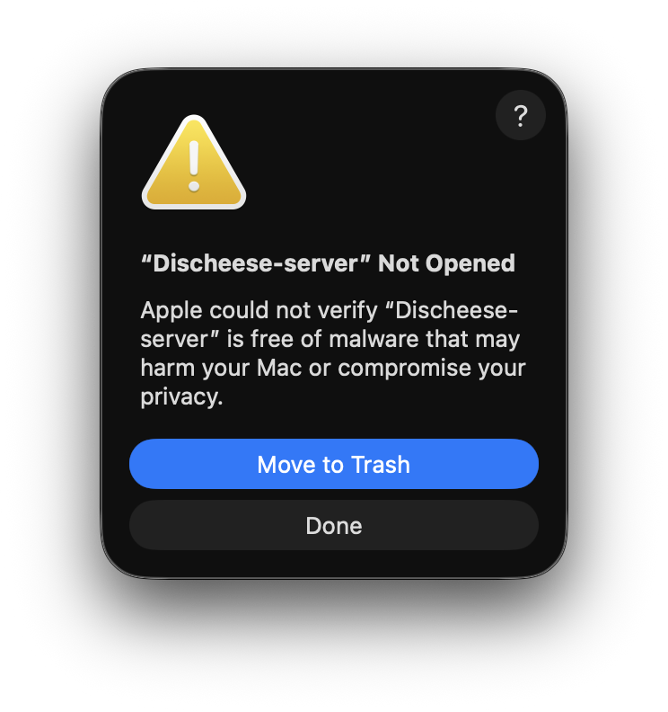
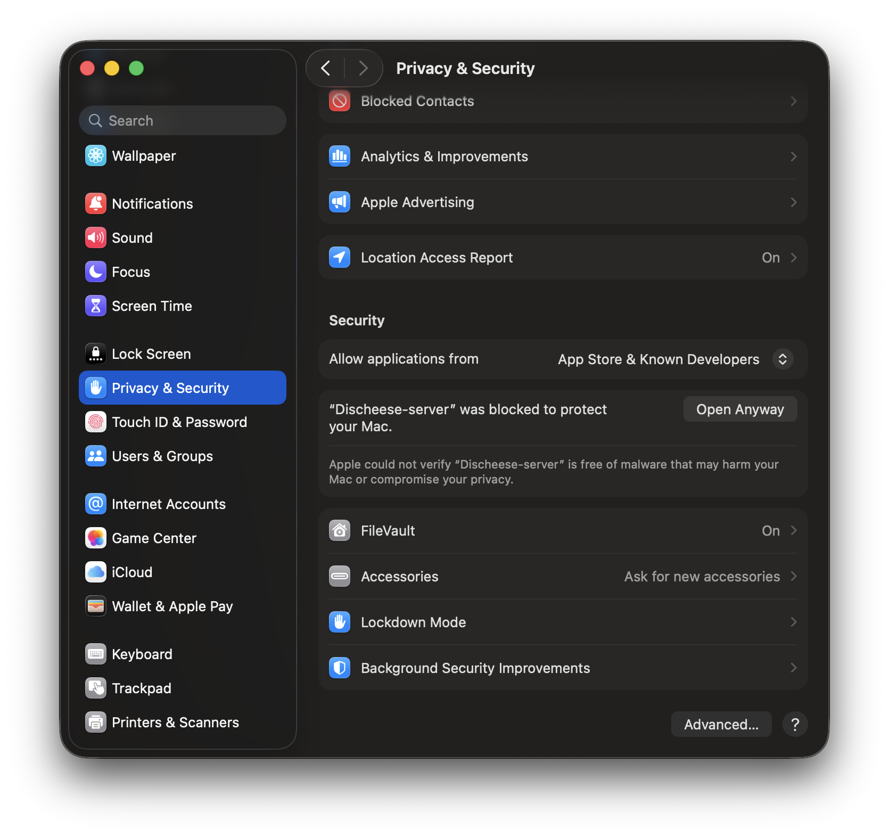
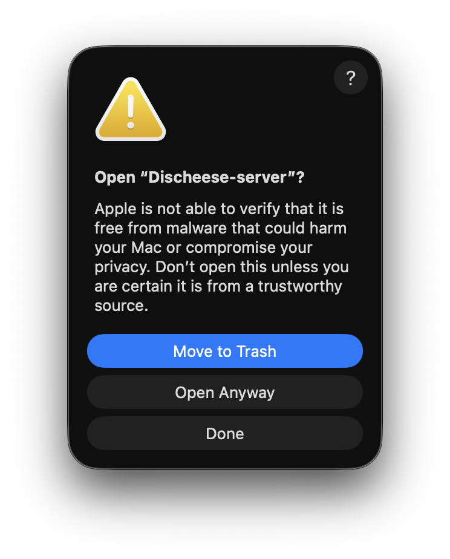

# Discheese 도움말

문제가 있으신가요? [문제 해결](#문제-해결)을 참고해주세요.  
서버 관련 질문이 있으신가요? [서버 관련](#서버-관련)을 참고해주세요.  
버그가 있으신가요? [Issues](https://github.com/Pro203S/chzzk-rpc/issues)에 제보하세요.

## 문제 해결

### macOS, Linux에서 서버가 켜지지 않아요.

서버와 같은 폴더에서 터미널을 열어주세요.  
터미널에 `chmod +x ./Discheese-server`를 입력해주세요.  

### macOS에서 서버가 열리지 않아요.

만약 아래 이미지처럼 창이 뜬다면 이 절차를 따라주세요.  
  

1. 시스템 설정을 여세요.
2. `개인정보 보호 및 보안`을 클릭해주세요.

  

3. 오른쪽에 `그래도 열기` 버튼을 클릭해주세요.
4. 다음과 같은 창이 뜨면 `열기`를 눌러주세요.

  

### 서버에 연결할 수 없어요.

작업관리자에서 Discheese-server가 열려있는지 확인해주세요.  
서버에서 사용할 포트가 사용중이지 않은 지 확인해주세요.  

### 로그 확인하기

OS에 따라 로그의 저장 경로가 다릅니다.  
|OS|경로|
|-|-|
|Windows|`%LOCALAPPDATA%\DischeeseServer` = `C:\Users\<사용자>\AppData\Local\DischeeseServer`|
|macOS|`~/Library/Application Support/DischeeseServer`|
|Linux|`$XDG_DATA_HOME/DischeeseServer` 또는 기본값 `~/.local/share/DischeeseServer`|

폴더 안에는 `discheese-날짜-시간.log` 파일들이 있습니다.  
오류가 난 시점에 맞는 로그를 확인하시면 됩니다.  

[Issues](https://github.com/Pro203S/chzzk-rpc/issues)에 제보하실때 로그를 같이 보내주시면 버그 해결에 매우 도움이 됩니다.  

## 서버 관련

[서버 다운로드](https://github.com/Pro203S/chzzk-rpc/releases)를 먼저 진행해주세요.  

> [!NOTE]
> 서버는 기본적으로 58127 포트를 사용합니다.  
> 따라서 컴퓨터에서 58127 포트를 사용하고 있을 경우 서버가 열리지 않습니다.  

### 인수와 함께 서버 실행하기

서버와 같은 폴더에서 터미널을 열어주세요.  

Windows의 경우: `Discheese-server.exe <인수>`로 실행합니다.  
예시: `Discheese-server.exe --port=58127`

macOS, Linux의 경우: `./Discheese-server <인수>`로 실행합니다.  
예시: `./Discheese-server --port=58127`

### 콘솔 열기

서버는 기본적으로 별도의 콘솔 창 없이 백그라운드에서 실행됩니다.  
백그라운드 서버를 실행한 터미널은 즉시 다시 사용할 수 있습니다.  
콘솔 로그를 확인하려면 `--open-console` 인수와 함께 실행해주세요.  
터미널에서 `Ctrl+C`를 눌러 종료할 수 있습니다.  

### 포트 변경하기

서버의 포트를 다른 포트로 변경하고싶다면 `--port=포트` 인수와 함께 실행해주세요.  
예를 들어, `--port=8080` 인수를 전달하면 서버는 8080 포트에서 열리게 됩니다.  

### 서버 자동 실행

컴퓨터를 켤 때 서버를 자동 실행하려면 서버를 `--register-autostart` 인수와 함께 실행해주세요.  
등록된 서버는 별도의 콘솔 창 없이 백그라운드에서 실행됩니다.  

- Windows: 창 없는 애플리케이션으로 실행
- Linux: 사용자 `systemd` 서비스로 실행
- macOS: 백그라운드 `LaunchAgent`로 실행

자동 실행을 삭제하려면 서버를 `--unregister-autostart` 인수와 함께 실행해주세요.  

자동 실행은 아래 경로 / 레지스트리에 등록됩니다.  

- Windows: `HKCU\Software\Microsoft\Windows\CurrentVersion\Run`
- Linux: `~/.config/systemd/user/discheese.service`
- macOS: `~/Library/LaunchAgents/kr.pro203s.discheese.plist`

Linux에서는 사용자 systemd가 활성화된 환경이 필요합니다.  
