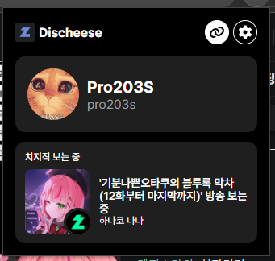
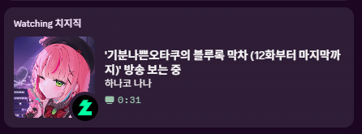
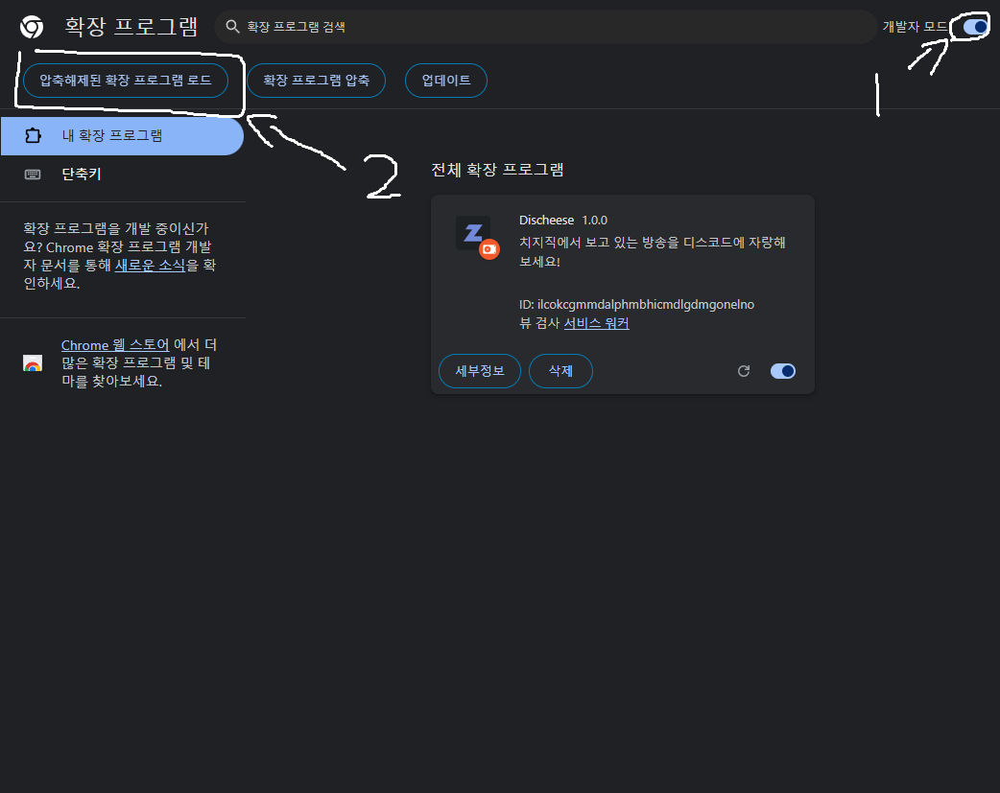

# Discheese

Discheese(디스치즈)는 치지직 방송을 Discord의 RPC에 표시해주는 Chrome 확장입니다.  

<table>
    <tr>
        <td>
            
        </td>
        <td>
            
        </td>
    </tr>
    <tr>
        <td align="center">확장</td>
        <td align="center">Discord</td>
    </tr>
</table>

## 기능

- Discord RPC에 현재 보는 치지직 방송 표시
- Windows, macOS, Linux를 모두 지원

## 설치 방법

> [!IMPORTANT]
> 현재 Chrome Web Store에 확장이 올라와있지 않은 관계로 [확장-수동 설치](#확장-수동-설치)법을 참고해주세요.

1. [Chrome Web Store](https://chromewebstore.google.com/)에서 Discheese 확장을 설치합니다.
2. [여기](https://github.com/Pro203S/chzzk-rpc/releases)에서 서버를 다운로드합니다.
3. 컴퓨터를 켤 때 서버를 같이 실행하고 싶다면 [여기](/HELP.md#서버-자동-실행)를 참고해주세요.

## 확장 수동 설치

1. [여기](https://github.com/Pro203S/chzzk-rpc/releases)에서 확장 zip파일을 다운받아주세요.
2. 다운 받은 확장 압축 파일의 압축을 해제해주세요.
3. `chrome://extensions/`에 들어가주세요.
4. 오른쪽 위 개발자 모드를 켜주세요.
5. 왼쪽 위의 `압축해제 된 확장 프로그램 로드`를 눌러주세요.
6. 압축을 해제한 확장 폴더를 선택해주세요. (폴더에 `manifest.json`이 있어야합니다)

